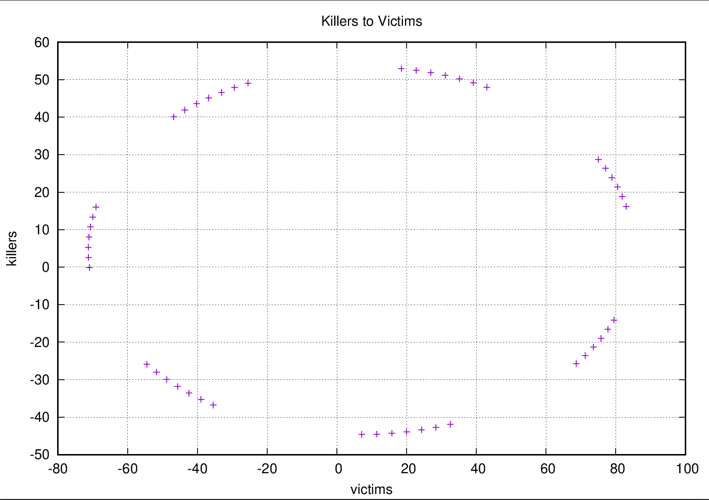

**Predator-Prey Model**
------------------------------

## Developer
[Paranid5](https://github.com/dinaraparanid)

## About project

Sample C++ project that computes and shows equations
for a randomly generated dataset with number of preys and predators.
Next equations describe the number of preys and predators depending on time:

Project was implemented as a homework assignment of
Analytical Geometry and Linear Algebra course in the Innopolis University.

## Preview
v(t) and k(t) graphs:

k(v) graph:

#### Dataset

**Time Limit:** 20

**α1:** 0.841183

**β1:** 0.664348

**α2:** 0.995244

**β2:** 0.980644

#### Acquired results

<table>
        <tr>
                <th>Time</th>
                <th>V(T)</th>
                <th>K(T)</th>
        </tr>
        <tr>
                <td>0.00</td>
                <td>30.00</td>
                <td>26.00</td>
        </tr>
        <tr>
                <td>1.00</td>
                <td>4.25</td>
                <td>47.52</td>
        </tr>
        <tr>
                <td>2.00</td>
                <td>-24.03</td>
                <td>32.95</td>
        </tr>
        <tr>
                <td>3.00</td>
                <td>-32.76</td>
                <td>-6.35</td>
        </tr>
        <tr>
                <td>4.00</td>
                <td>-15.13</td>
                <td>-39.71</td>
        </tr>
        <tr>
                <td>5.00</td>
                <td>15.10</td>
                <td>-41.09</td>
        </tr>
        <tr>
                <td>6.00</td>
                <td>34.34</td>
                <td>-9.42</td>
        </tr>
        <tr>
                <td>7.00</td>
                <td>27.57</td>
                <td>30.59</td>
        </tr>
        <tr>
                <td>8.00</td>
                <td>0.08</td>
                <td>47.71</td>
        </tr>
        <tr>
                <td>9.00</td>
                <td>-26.68</td>
                <td>28.59</td>
        </tr>
        <tr>
                <td>10.00</td>
                <td>-31.83</td>
                <td>-11.86</td>
        </tr>
        <tr>
                <td>11.00</td>
                <td>-11.35</td>
                <td>-42.06</td>
        </tr>
        <tr>
                <td>12.00</td>
                <td>18.78</td>
                <td>-38.46</td>
        </tr>
        <tr>
                <td>13.00</td>
                <td>35.05</td>
                <td>-3.85</td>
        </tr>
        <tr>
                <td>14.00</td>
                <td>24.76</td>
                <td>34.75</td>
        </tr>
        <tr>
                <td>15.00</td>
                <td>-4.06</td>
                <td>47.22</td>
        </tr>
        <tr>
                <td>16.00</td>
                <td>-28.92</td>
                <td>23.83</td>
        </tr>
        <tr>
                <td>17.00</td>
                <td>-30.41</td>
                <td>-17.17</td>
        </tr>
        <tr>
                <td>18.00</td>
                <td>-7.38</td>
                <td>-43.78</td>
        </tr>
        <tr>
                <td>19.00</td>
                <td>22.20</td>
                <td>-35.24</td>
        </tr>
        <tr>
                <td>20.00</td>
                <td>35.25</td>
                <td>1.79</td>
        </tr>
</table>

*Equations:*

v(t) = 28.99 * cos(0.92t) - 18.17 * sin(0.92t) + 1.02

k(t) = 39.33 * sin(0.91t) + 24.73 * cos(0.91t) + 1.27

## Requirements:
1) C++20
2) Boost and Gnuplot libraries