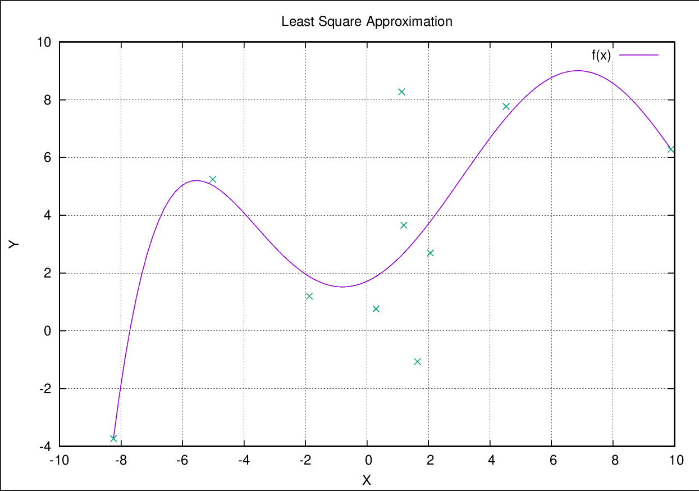

**Least Square Approximation**
------------------------------

## Developer
[Paranid5](https://github.com/dinaraparanid)

## About project

Sample C++ project that computes and shows equation
for a given dataset with Least Square Approximation method.
Project was implemented as a homework assignment of
Analytical Geometry and Linear Algebra course in the Innopolis University.

## Preview

#### Dataset

<table>
    <tr>
        <th>Point</th>
        <th>A</th>
        <th>b</th>
    </tr>
    <tr>
        <td>1</td>
        <td>1.12631</td>
        <td>8.27363</td>
    </tr>
    <tr>
        <td>2</td>
        <td>9.88268</td>
        <td>6.28246</td>
    </tr>
    <tr>
        <td>3</td>
        <td>2.06208</td>
        <td>2.6931</td>
    </tr>
    <tr>
        <td>4</td>
        <td>0.295517</td>
        <td>0.764073</td>
    </tr>
    <tr>
        <td>5</td>
        <td>4.52515</td>
        <td>7.76812</td>
    </tr>
    <tr>
        <td>6</td>
        <td>-1.87306</td>
        <td>1.19877</td>
    </tr>
    <tr>
        <td>7</td>
        <td>-8.24107</td>
        <td>-3.72977</td>
    </tr>
    <tr>
        <td>8</td>
        <td>1.63913</td>
        <td>-1.06747</td>
    </tr>
    <tr>
        <td>9</td>
        <td>1.19469</td>
        <td>3.65555</td>
    </tr>
    <tr>
        <td>10</td>
        <td>-5.01194</td>
        <td>5.2447</td>
    </tr>
</table>

#### Acquired results

*Approximate value of X:*

{
    1.7146
    0.489087
    0.296526
    -0.0146085
    -0.00423156
    0.000267849
}

*Equation:*

f(x) = 1.7146 * x^0 + 0.489087 * x^1 + 0.296526 * x^2 + -0.0146085 * x**3 + -0.00423156 * x^4 + 0.000267849 * x^5 + 0

## Requirements:
1) C++20
2) Boost and Gnuplot libraries