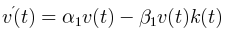
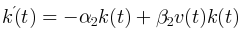
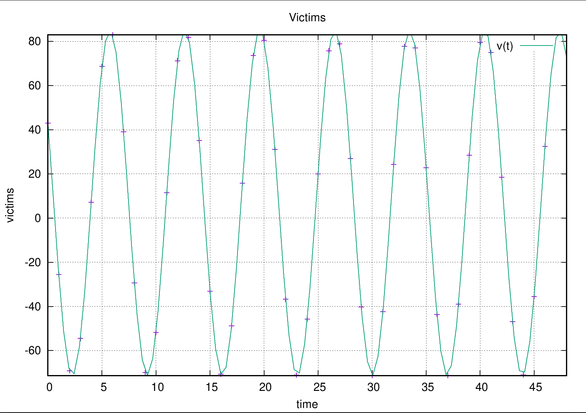
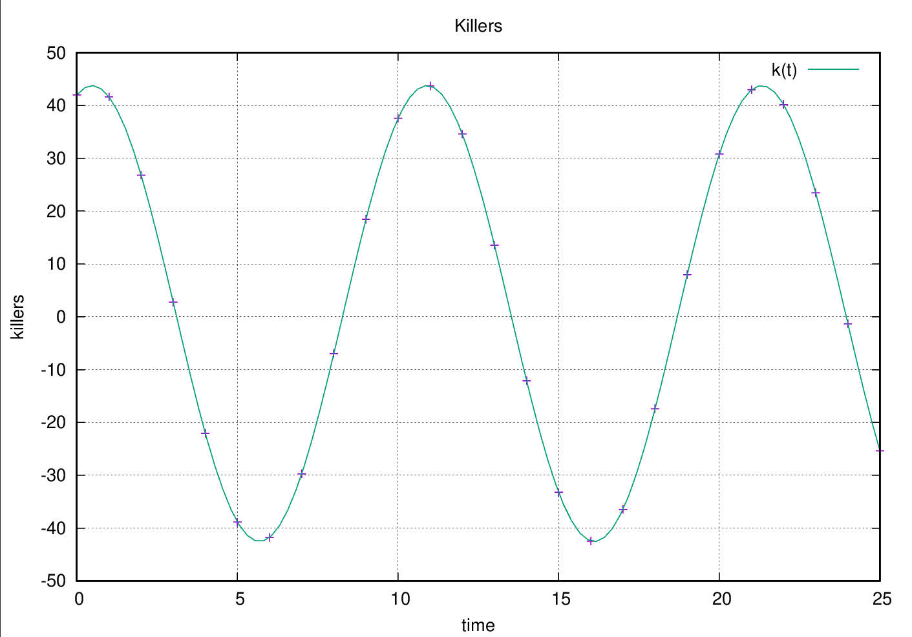

**Predator-Prey Model**
------------------------------

## Developer
[Paranid5](https://github.com/dinaraparanid)

## About project

Sample C++ project that computes and shows equations
for a randomly generated dataset with number of preys and predators.
Next equations describe the number of preys and predators depending on time:

Project was implemented as a homework assignment of
Analytical Geometry and Linear Algebra course in the Innopolis University.

## Preview

#### Dataset

**Time Limit:** 25

**Points:** 25

**α1:** 0.419301

**β1:** 0.676932

**α2:** 0.866842

**β2:** 0.555237

#### Acquired results

<table>
    <tr>
        <th>Time</th>
        <th>V(T)</th>
        <th>K(T)</th>
    </tr>
    <tr>
        <td>0</td>
        <td>23.00</td>
        <td>42.00</td>
    </tr>
    <tr>
        <td>1</td>
        <td>-21.91</td>
        <td>41.64</td>
    </tr>
    <tr>
        <td>2</td>
        <td>-58.54</td>
        <td>26.82</td>
    </tr>
    <tr>
        <td>3</td>
        <td>-73.99</td>
        <td>2.76</td>
    </tr>
    <tr>
        <td>4</td>
        <td>-62.79</td>
        <td>-22.06</td>
    </tr>
    <tr>
        <td>5</td>
        <td>-28.90</td>
        <td>-38.88</td>
    </tr>
    <tr>
        <td>6</td>
        <td>15.72</td>
        <td>-41.77</td>
    </tr>
    <tr>
        <td>7</td>
        <td>55.36</td>
        <td>-29.71</td>
    </tr>
    <tr>
        <td>8</td>
        <td>76.02</td>
        <td>-6.97</td>
    </tr>
    <tr>
        <td>9</td>
        <td>70.44</td>
        <td>18.46</td>
    </tr>
    <tr>
        <td>10</td>
        <td>40.56</td>
        <td>37.59</td>
    </tr>
    <tr>
        <td>11</td>
        <td>-3.06</td>
        <td>43.69</td>
    </tr>
    <tr>
        <td>12</td>
        <td>-45.06</td>
        <td>34.60</td>
    </tr>
    <tr>
        <td>13</td>
        <td>-70.61</td>
        <td>13.53</td>
    </tr>
    <tr>
        <td>14</td>
        <td>-70.72</td>
        <td>-12.09</td>
    </tr>
    <tr>
        <td>15</td>
        <td>-45.35</td>
        <td>-33.23</td>
    </tr>
    <tr>
        <td>16</td>
        <td>-3.43</td>
        <td>-42.44</td>
    </tr>
    <tr>
        <td>17</td>
        <td>40.25</td>
        <td>-36.46</td>
    </tr>
    <tr>
        <td>18</td>
        <td>70.28</td>
        <td>-17.41</td>
    </tr>
    <tr>
        <td>19</td>
        <td>76.09</td>
        <td>8.00</td>
    </tr>
    <tr>
        <td>20</td>
        <td>55.61</td>
        <td>30.80</td>
    </tr>
    <tr>
        <td>21</td>
        <td>16.08</td>
        <td>42.97</td>
    </tr>
    <tr>
        <td>22</td>
        <td>-28.57</td>
        <td>40.20</td>
    </tr>
    <tr>
        <td>23</td>
        <td>-62.60</td>
        <td>23.48</td>
    </tr>
    <tr>
        <td>24</td>
        <td>-74.00</td>
        <td>-1.31</td>
    </tr>
    <tr>
        <td>25</td>
        <td>-58.77</td>
        <td>-25.41</td>
    </tr>
</table>

*Equations:*

v(t) = 21.44 * cos(sqrt(0.42 * 0.87) * x) - 41.38 * (sqrt(0.87) * 0.68 / (0.56 * sqrt(0.42))) * sin(sqrt(0.42 * 0.87) * x) + 0.87 / 0.56

k(t) = 21.44 * (sqrt(0.42) * 0.56 / (0.68 * sqrt(0.87))) * sin(sqrt(0.42 * 0.87) * x) + 41.38 * cos(sqrt(0.42 * 0.87) * x) + 0.42 / 0.68

## Requirements:
1) C++20
2) Boost and Gnuplot libraries