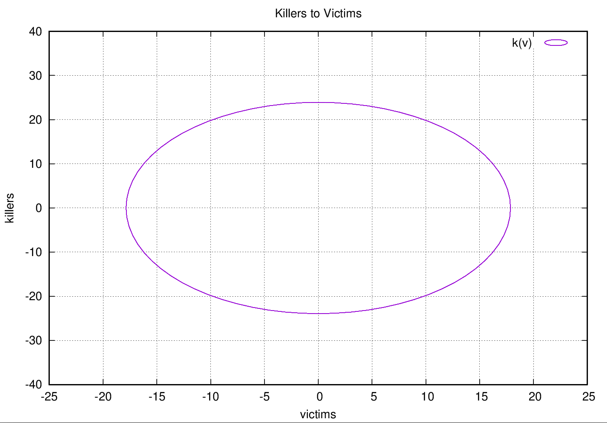

**Predator-Prey Model**
------------------------------

## Developer
[Paranid5](https://github.com/dinaraparanid)

## About project

Sample C++ project that computes and shows equations
for a randomly generated dataset with number of preys and predators.
Next equations describe the number of preys and predators depending on time:

Project was implemented as a homework assignment of
Analytical Geometry and Linear Algebra course in the Innopolis University.

## Preview
v(t) graph:

k(t) graph:

k(v) graph:

#### Dataset

**Time Limit:** 46

**α1:** 0.921802

**β1:** 0.207130

**α2:** 0.889418

**β2:** 0.127444

#### Acquired results

<table>
        <tr>
                <th>Time</th>
                <th>V(T)</th>
                <th>K(T)</th>
        </tr>
        <tr>
	        <td>0.00</td>
                <td>43.00</td>
                <td>48.00</td>
        </tr>
        <tr>
                <td>1.00</td>
                <td>-25.48</td>
                <td>49.09</td>
        </tr>
        <tr>
                <td>2.00</td>
                <td>-69.12</td>
                <td>16.01</td>
        </tr>
        <tr>
                <td>3.00</td>
                <td>-54.51</td>
                <td>-25.91</td>
        </tr>
        <tr>
                <td>4.00</td>
                <td>7.15</td>
                <td>-44.60</td>
        </tr>
        <tr>
                <td>5.00</td>
                <td>68.69</td>
                <td>-25.74</td>
        </tr>
        <tr>
                <td>6.00</td>
                <td>82.99</td>
                <td>16.22</td>
        </tr>
        <tr>
                <td>7.00</td>
                <td>39.12</td>
                <td>49.18</td>
        </tr>
        <tr>
                <td>8.00</td>
                <td>-29.35</td>
                <td>47.90</td>
        </tr>
        <tr>
                <td>9.00</td>
                <td>-70.02</td>
                <td>13.37</td>
        </tr>
        <tr>
                <td>10.00</td>
                <td>-51.75</td>
                <td>-27.99</td>
        </tr>
        <tr>
                <td>11.00</td>
                <td>11.46</td>
                <td>-44.52</td>
        </tr>
        <tr>
                <td>12.00</td>
                <td>71.25</td>
                <td>-23.57</td>
        </tr>
        <tr>
                <td>13.00</td>
                <td>81.84</td>
                <td>18.83</td>
        </tr>
        <tr>
                <td>14.00</td>
                <td>35.14</td>
                <td>50.22</td>
        </tr>
        <tr>
                <td>15.00</td>
                <td>-33.12</td>
                <td>46.58</td>
        </tr>
        <tr>
                <td>16.00</td>
                <td>-70.69</td>
                <td>10.70</td>
        </tr>
        <tr>
                <td>17.00</td>
                <td>-48.81</td>
                <td>-29.96</td>
        </tr>
        <tr>
                <td>18.00</td>
                <td>15.76</td>
                <td>-44.29</td>
        </tr>
        <tr>
                <td>19.00</td>
                <td>73.61</td>
                <td>-21.31</td>
        </tr>
        <tr>
                <td>20.00</td>
                <td>80.47</td>
                <td>21.38</td>
        </tr>
        <tr>
                <td>21.00</td>
                <td>31.08</td>
                <td>51.12</td>
        </tr>
        <tr>
                <td>22.00</td>
                <td>-36.76</td>
                <td>45.13</td>
        </tr>
        <tr>
                <td>23.00</td>
                <td>-71.12</td>
                <td>8.01</td>
        </tr>
        <tr>
                <td>24.00</td>
                <td>-45.70</td>
                <td>-31.84</td>
        </tr>
        <tr>
                <td>25.00</td>
                <td>20.03</td>
                <td>-43.91</td>
        </tr>
        <tr>
                <td>26.00</td>
                <td>75.78</td>
                <td>-18.97</td>
        </tr>
        <tr>
                <td>27.00</td>
                <td>78.87</td>
                <td>23.89</td>
        </tr>
        <tr>
                <td>28.00</td>
                <td>26.94</td>
                <td>51.88</td>
        </tr>
        <tr>
                <td>29.00</td>
                <td>-40.27</td>
                <td>43.56</td>
        </tr>
        <tr>
                <td>30.00</td>
                <td>-71.31</td>
                <td>5.31</td>
        </tr>
        <tr>
                <td>31.00</td>
                <td>-42.44</td>
                <td>-33.60</td>
        </tr>
        <tr>
                <td>32.00</td>
                <td>24.26</td>
                <td>-43.39</td>
        </tr>
        <tr>
                <td>33.00</td>
                <td>77.73</td>
                <td>-16.57</td>
        </tr>
        <tr>
                <td>34.00</td>
                <td>77.05</td>
                <td>26.34</td>
        </tr>
        <tr>
                <td>35.00</td>
                <td>22.74</td>
                <td>52.49</td>
        </tr>
        <tr>
                <td>36.00</td>
                <td>-43.63</td>
                <td>41.88</td>
        </tr>
        <tr>
                <td>37.00</td>
                <td>-71.27</td>
                <td>2.61</td>
        </tr>
        <tr>
                <td>38.00</td>
                <td>-39.02</td>
                <td>-35.24</td>
        </tr>
        <tr>
                <td>39.00</td>
                <td>28.44</td>
                <td>-42.72</td>
        </tr>
        <tr>
                <td>40.00</td>
                <td>79.47</td>
                <td>-14.09</td>
        </tr>
        <tr>
                <td>41.00</td>
                <td>75.02</td>
                <td>28.72</td>
        </tr>
        <tr>
                <td>42.00</td>
                <td>18.49</td>
                <td>52.96</td>
        </tr>
        <tr>
                <td>43.00</td>
                <td>-46.84</td>
                <td>40.07</td>
        </tr>
        <tr>
                <td>44.00</td>
                <td>-70.99</td>
                <td>-0.08</td>
        </tr>
        <tr>
                <td>45.00</td>
                <td>-35.46</td>
                <td>-36.77</td>
        </tr>
        <tr>
                <td>46.00</td>
                <td>32.55</td>
                <td>-41.91</td>
        </tr>
</table>

*Equations:*

v(t) = 36.02 * cos(0.9t) - 43.55 * 69.19 * sin(0.9t) + 6.85

k(t) = 22.67 * sin(0.9t) + 43.55 * cos(0.9t) + 4.38

## Requirements:
1) C++20
2) Boost and Gnuplot libraries